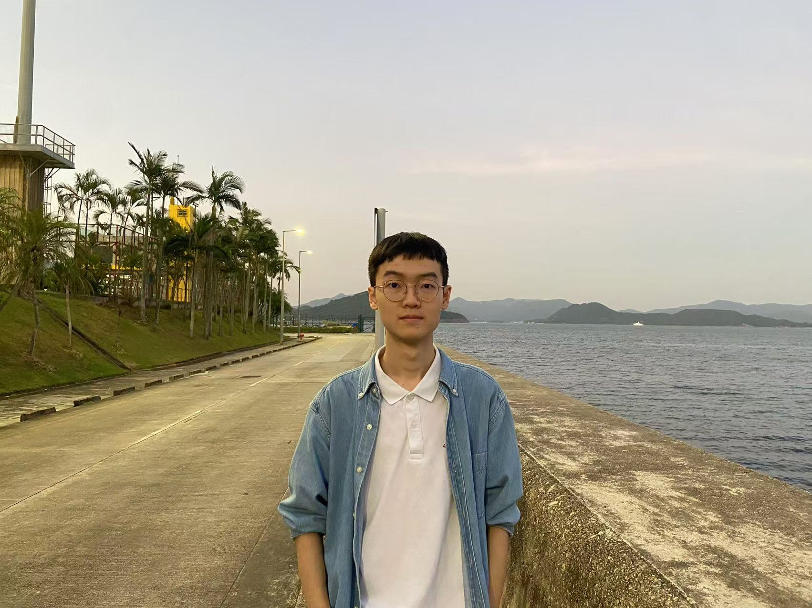

    
    

    	
Greetings! I am Yunqi Li, a senior undergraduate in <a href="https://hkust.edu.hk/">Hong Kong Univ. of Sci. and Tech.</a>, majoring <a href="https://cse.hkust.edu.hk/bsc/">Computer Science and General Mathematics</a>. I spent a wonderful semester on exchange in <a href="https://uwaterloo.ca/">Univ. of Waterloo</a> in spring 2024.

      
Email: liyunqixaATgmail.com &nbsp; <a href="./images/wechat.jpg">WeChat</a> &nbsp; <a href="https://github.com/EricLYunqi">Github</a> &nbsp; <a href="https://scholar.google.com/citations?user=S9cOeVAAAAAJ&hl=zh-CN">Google Scholar</a>

    

## Research
I am boardly interested in database and data management. I work on graph query with Prof. Kai Huang and Prof. Xiaofang Zhou as well as data integration with Prof. Dong Deng.

### Publications 
- **FRESH: Towards Efficient Graph Queries in an Outsourced Graph**  Kai Huang\*, <u>Yunqi Li</u>\*, Qinging Ye, Yao Tian, Xi Zhao, Yue Cui, Haibo Hu, Xiaofang Zhou  ICDE 2024 [[pdf]](papers/FRESH_Towards_Efficient_Graph_Queries_in_an_Outsourced_Graph.pdf). 

- **Math for AI: On the Generalization of Learning Mathematical Problem Solving**   Ruochen Zhou, Minrui Xu, Siqi Chen, Junteng Liu, <u>Yunqi Li</u>, Xinin Lin, Zhengyu Chen, Junxian He  MATH-AI Workshop in NeurIPS 2024.
  

\* indicates equal contribution.

### Software/System(s)
- **Similarity Join Entity Matching**  [[code]](https://github.com/rutgers-db/EntityBlockingBySimilarityJoins)

## Teaching
- COMP2012: Object-Oriented Programming and Data Structures, Fall 2023
- COMP1021: Introduction to Computer Science, Fall 2022

## Awards
- Second Runner up, UROP Awards 2024
- Best Mini Conference Paper Award, UROP 2024
- Continuing Scholarship, HKUST
- School of Engineering Dean's List, HKUST

## Mathematics
I have taken several pure/applied math courses:
- Fall 2022: Multivariable Calculus, Linear Algebra
- Spring 2022: Probability, Game Theory
- Fall 2023: Mathematical Analysis, Abstract Algebra, Combinatorics
- Spring 2023: Differential Equation, Number Theory

## Quote

> 总之岁月漫长，然而值得等待。